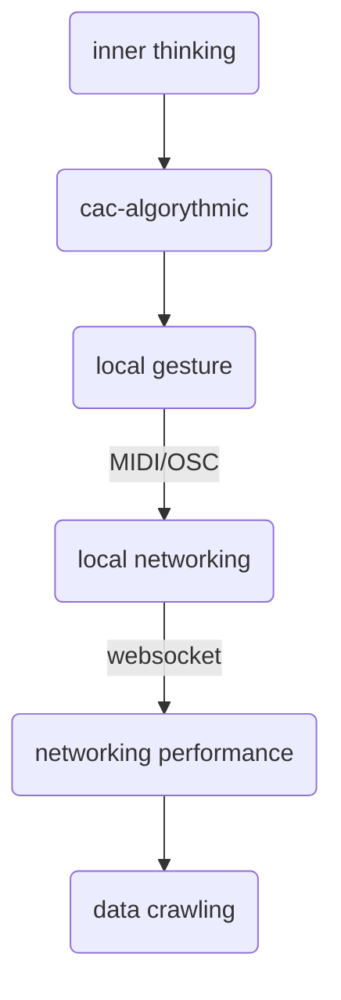

---
tags:
  - class
class: intro
number: "01"
yearupdate: "24"
date: 2023-09-22
---


|  |                |                        |
| ---------------------------------------- | :------------- | ---------------------: |
| **class 01**                 |  | *internet music 24-25* |


## intro to
# INTERNET MUSIC
---


<p style="text-align:center;">a production workshop focused on <br> musical tools in relation to the internet<br> covering transversally the </p>
history of electronic music related to  <strong style="color:yellow">networking</strong></p>
 <strong style="color:cyan">internet culture</strong> as a context and generator of themes and styles</p>
 the  <strong style="color:magenta">paradigms</strong> of networked performance. </p>
</p>

---

 ### what we can do

---
### how 
---

### what we can do 


---

## origins of the algorythmic thinking

---

## logarithms

In 1614, John Napier proposes a new mathematical method, called the logarithm, in a work called Mirifici Logarithmorum Canonis Descriptio


---

something like the <br>
## <span style="color:#ffff00">Description of the marvelous law of logarithms.</span>

**Napier** was in contact with the big mathematician and inventors of his time as  [[Tisho Brahe]] and [[Johannes Kepler]]
Thus, thanks to Napier's invention, Brahe was able to discover the first supernova. [thanks to **brass azimuthal quadrant]**
</p>

---

We can define a <span style="color:#ffff00">logarithm</span> as an easy way to remember a multiplication (or the comparision of sizes) . In contemporary mathematics this is known as ismorphism.

---

Going further, each of the **numerical discoveries** can also be seen as a new compression in the <span style="color:#92d050">performability</span> of a <span style="color:#92F0F0">quantity</span> of data, or an <span style="color:#d763d9">isomorphic translation</span> between dictionaries, from an individual mental operation, through the workbench, the creation of the university and the collaborative work of the internet repositories in the 21st century.

---

The <span style="color:#d763d9">slide</span> rule of **Edmund Gunther** and later **William Oughtred,** using the principles of logarithms to divide and multiply.

<iframe src="https://inteng-storage.s3.amazonaws.com/images/MARCH/sizes/slide_rule_resize_md.jpg" object-fit=cover width=75% height=58% ></iframe>


---

📕 Origins of Algorithmic Musical thinking (2020)
**Magnusson**, Thor. Algorithms as Scores: Coding Live Music

---

Guidonean hand

<iframe src="https://images.fineartamerica.com/images/artworkimages/mediumlarge/2/guidonian-hand-guido-of-arezzo.jpg" object-fit=cover width=75% height=100%></iframe>

---

guidonean interactive 

https://editor.p5js.org/zzigo/sketches/Zna6QQgWQ

---

## 2 principles

*  <span style="color:#03D9DD">mnemonics</span> as an automation and exsomatization of memory.
*  <span style="color:#ffff00">ratio</span> (the transformation of an analog domain, the pitch into a quantizated domain, the spiral and the scale).

---

[[internet technologies.canvas|internet technologies]]

---

Foundation of algorythmic thinking

## indeterminacy

---
**Randomness** is one of the first possible actions to be performed on a computer. This is known as <span style="color:#d763d9">RGn</span> (random number generation).  

---

If we think about the simplest forms of randomness, we can draw a directly proportional relationship between its efficiency and the amount of <span style="color:#92d050">unpredictability</span> (in general given by the number of factors).  

---
Between comparing the toss of a coin and a die, we understand that the unpredictability of the coin is 2 and that of the die is 6, and the number of factors is the sum of forces, environmental conditions, execution, etc.  

---

In the case of computers, physical phenomena such as radioactive decay, thermal noise, Zener diode spikes are used, although the most common method is the PRnG and the linear congruential generator.  

---

## free random 

```js
console.log (Math.random())
```

---
# constrained random

```js
var lowerLimit = 10;
var upperLimit = 30;
var range = upperLimit - lowerLimit;

var numRandom = Math.random() * range + lowerLimit

console.log ("limited random  :", numRandom, "\n", "integer limited random :", Math.round(numRandom) )
```

---


> [!tip]  tOdO
> make a melodic generator of only 3 successive notes of the scale.


---
<iframe src="https://codepen.io/LucianoAzzigotti/pen/XWExLJv?editors=1111" allow="fullscreen" allowfullscreen="" style="height:100%;width:100%; aspect-ratio: 16 / 9; "></iframe>

---
solution

<iframe src="https://codepen.io/LucianoAzzigotti/pen/abYRgBv" style="height:100%;width:100%; aspect-ratio: 16 / 9; "></iframe>

---
## social internet

Internet can be understood as a complex being formed from five kinds of intertwined coexisting **networks**

---
the net, the web, the social networks, the <span style="color:#92d050">IoT</span>, and the<span style="color:#ffff00"> sharing networks</span> (file sharing, blockchain, and distributed-apps)


---

In the second decade of XXI , Internet can be understood as a complex being formed from **5** kinds of intertwined coexisting **networks**: the <span style="color:#ffff00">net</span>, the <span style="color:#ffc000">web</span>, the <span style="color:#92d050">social</span> networks, the <span style="color:#4983d0">IoT</span>, and the <span style="color:#d763d9">sharing</span> networks(file sharing, blockchain, and distributed-apps)

---

identifying and lo shaping influences of certain social and cultural relationships on the formation of the internet makes it easier for us to consider and identify the opposite relationships (i.e. to study the social and cultural impacts of internet use)

---

# memetics

* archetypes of social behaviours
	* fads -> any form of collective behaviour that develops within a culture

 * 


---

* creative reproduction of materials
 * intertextuality 

planking
literal video music
pop culture appropriation

---

<iframe title="Total Eclipse of the Heart Literal Video Version" src="https://www.youtube.com/embed/fsgWUq0fdKk?feature=oembed" height="150" width="200" allowfullscreen="" allow="fullscreen" style="aspect-ratio: 1.33333 / 1; width: 100%; height: 100%;"></iframe>

---

4.  new format paradigms
    -   mnemonic medium (a media that makes users to remember what they read → auto-grading) ex: anki, quizlet, duolingo, memrise, srm systems.
    -   mnemonic video
    -   executable books → [jupyter](https://executablebooks.org/en/latest/gallery.html) / google colab / github ([ex](https://mitpress.mit.edu/sites/default/files/titles/content/sicm_edition_2/book.html), [Ex](https://github.com/norvig/pytudes/blob/master/ipynb/Economics.ipynb))
    -   dynamics music scores

---

# nft

![[0-internet music-1.png]]
http://torquetorque.net/wp-content/uploads/ArtistsReThinkingTheBlockchain.pdf


---

non-fungible tokens, as a blockchain-based digital material exclusivity contract, introduced scarcity to the world of art and digital collectibles.

-   Joselit, NFTs, or The Readymade Reversed
    
   note:  Marcel Duchamp prooved in 1913-15 that a quantum of information, could disorganize the objectivity of a snow shovel by transposing it as art. With the readymade of Fountain, 1917, Duchamp gave sculpture over to information on two registers: He desublimated matter by suspending it between two names, shovel and sculpture; and he abandoned objects for discourse. Desublimation and abandonment.
    
---
The NFT arrival, reverse the duchampial gesture, as the clousure of the information’s commodification cycle fundamental to late capitalism.

---

https://www.fxhash.xyz/generative/slug/cyanotypes

---

# local intranet 

## node.js

local networked scores 

---

# internet music instruments

---

##  2014, Jono Brandel, Patatap

[https://patatap.com/](https://patatap.com)

Patatap is a visual sound kit application with animations by computer programmer Jono Brandel and Japanese electronic duo Lullatone, consisting of Shawn James Seymour and Yoshimi Tomida.


---

##  2019 Devine Lu Linvega

[https://hundredrabbits.github.io/Orca/](https://hundredrabbits.github.io/Orca/)

-   creation by misunderstanding (specifically the misunderstanding how tidal works)
-   orca originated from a simple videogame to a music-language-tool
-   reflecting single-character operators, no abstraction
-   all code and data visible all-time [space = memory]
-   influence by Ancient Domains of Mystery
-   and chain reaction-type machines as the Rube Goldberg machine.

---

# data-driven art

http://5.2.16.88/Freesound-Trip/

https://labs.freesound.org/fse/

---

# a networking performance example 


nexus hub

https://replit.com/@jsmusic/nexushub

---

# metaverses


https://feralfile.com/artworks/earmark-jnw

--- 

<iframe title="SONIC VIRTUALITIES: Matthew D. Gantt" src="https://www.youtube.com/embed/mwSwUonMDWg?feature=oembed" height="113" width="200" allowfullscreen="" allow="fullscreen" style="aspect-ratio: 1.76991 / 1; width: 100%; height: 100%;"></iframe>

--- 

https://t.co/3cWn2KO4hT

---

https://t.co/DRgqakgV5W

---

## how 

---

html 

css

js

tone.js

---

## scheduling
<iframe src="https://codepen.io/LucianoAzzigotti/pen/abYRgBv" allow="fullscreen" allowfullscreen="" style="height:100%;width:100%; aspect-ratio: 16 / 9; "></iframe>

--- 


---

<iframe src="https://codepen.io/LucianoAzzigotti/pen/wvPvrrO" allow="fullscreen" allowfullscreen="" style="height:100%;width:100%; aspect-ratio: 16 / 9; "></iframe>


### **Transport**

[Tone.Transport](https://tonejs.github.io/docs/Transport) unlike AudioContext can be started, stopped, looped, adjusted etc. on the fly.

[Tone.Loop](https://tonejs.github.io/docs/Loop) it's a  loop.

---

```js

// crea dos sintes mono 
const synthA = new Tone.FMSynth().toDestination(); 
const synthB = new Tone.AMSynth().toDestination(); 

const loopA = new Tone.Loop(time => { synthA.triggerAttackRelease("C2", "8n", time); }, "4n").start(0); const loopB = new Tone.Loop(time => { synthB.triggerAttackRelease("C4", "8n", time); }, "4n").start("8n"); //empieza luego del sinthA 

Tone.Transport.start()

```

---

<iframe src="https://codepen.io/LucianoAzzigotti/pen/vYWYOzV" allow="fullscreen" allowfullscreen="" style="height:100%;width:100%; aspect-ratio: 16 / 9; "></iframe>


---

<iframe src="https://codepen.io/LucianoAzzigotti/pen/abYRgBv?editors=1010" allow="fullscreen" allowfullscreen="" style="height:100%;width:100%; aspect-ratio: 16 / 9; "></iframe>


## Signals 

Signals are like AudioParams in the sense that you can use them to change values like a knob. They also allow you to program automated events and smoothly change values.


```js
var osc = new Tone.Oscillator("C4", "square").toMaster().start(0).stop(3);

osc.frequency.exponentialRampToValue("C1", 2);

```


