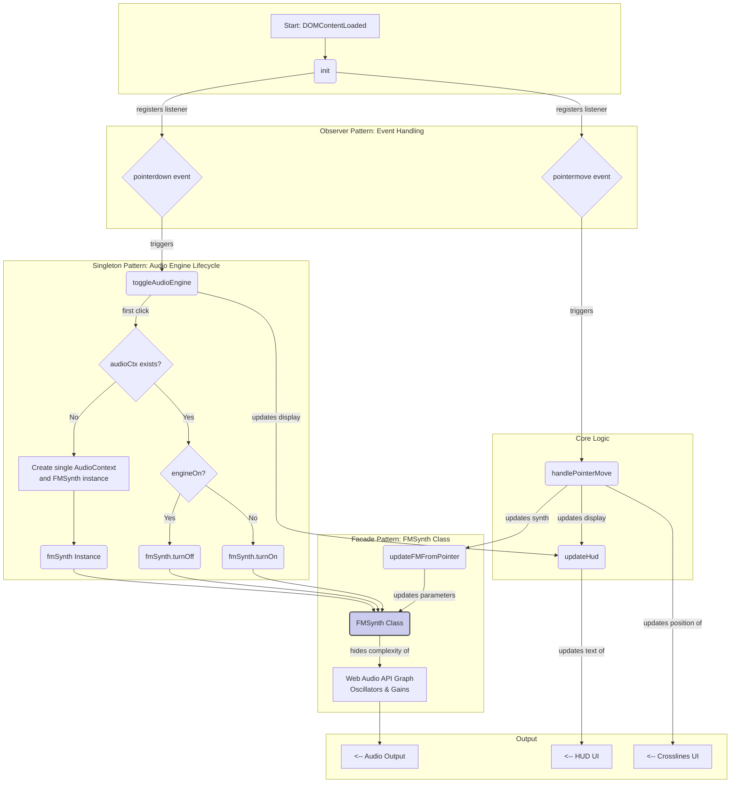

# IMI 1

## breakout of technologies
[[vite]]
[[design patterns]]
	[[singleton pattern]]
	[[facade pattern]]
	[[observer pattern]]
[[webaudio-initialization]]
[[fm-synthesis]]
[[how-to-create-a-github-repository]]
[[deployment]]

## 1. Conceptual frame for Project 1: FM synth as IMI


We start with a single-page “Internet Music Instrument”:
- Technology: Vite + vanilla JS + WebAudio.
- Interface: fullscreen, dark background, neon-ish UI, minimal text.
- Sound engine: 1 carrier oscillator, 1 modulator oscillator, classic FM:
	- Carrier frequency: $f_c$
	- Modulator frequency: $f_m$
	- Modulation index: $I$
	- Output:
	$$
        y(t) = A \sin \big( 2\pi f_c t + I \sin (2\pi f_m t ) \big)
        $$
- Mapping: sliders for $f_c$, $f_m$, $I$ and output gain.
We will keep oscillators running and control only gains and frequencies. This avoids the “oscillators can’t be restarted after stop()” issue and behaves more like a continuous instrument.


## 2. Project skeleton with Vite (vanilla)

Commands:
1. Create project:
    npm create vite@latest internet-music-fm – –template vanilla
    cd internet-music-fm
    npm install
2. Run dev server:
    npm run dev
We will mainly edit:
- index.html
- main.js
- style.css (optional but I include a minimal one)

## 3. index.html: fullscreen IMI layout

### creating a vite project

```bash
npm create vite@latest im1-fmsynth -- --template vanilla

cd im1-fmsynth
npm install
npm run dev

# build for production
npm run build

# (optional) preview for production
```

Put this in index.html (inside the Vite project), replacing the default body. Keep the script tag as Vite expects: type=“module” src=”src/main.js”.

![[im1-fmsynth/src/main.js]]

## 4. style.css: simple neon / wireframe feeling

 Create style.css in the src/ folder (Vite serves it fine).

![[im1-fmsynth/src/style.css]]

## 5. main.js: FM synth engine in one file


Key design decisions:
- Single AudioContext, created only after a user gesture.
- FMSynth implemented as a small class (creational pattern: simple Factory by new FMSynth(ctx)).
- Oscillators always running; gain shapes the “play/stop”.
- Mapping slider → parameters:
    - carrier frequency: direct.
    - mod frequency: direct.
    - modulation index I: transforms to a frequency deviation via Δf = I·f_m, so we set:
        modGain.gain = I * f_m
    - output gain: directly controls output.gain.
- 





## 5. Why Vite vanilla

For this course and today’s goal:
- Vite vanilla is enough and closer to “JS from scratch”.
- It forces non-coders  to see the real AudioContext, DOM, events without abstraction.
- Build setup is already modern (ES modules, HMR, production builds) so we can scale later.

We introduce React when:
1. We add a Three.js scene with multiple objects and need **component-level state.**
2. We want React Three Fiber for more complex 3D instrument UIs.
3. We need more structured UI patterns (e.g. multiple panels, routing, presets, patch browsers).

So on further classes we will go for Stage 2-3:
- Stage 1 (FM synth, mic input, basic analysis): Vite vanilla.
- Stage 2–3 (3D nodes, spatial mapping, gesture-based FM emitters): migrate or parallel project in React + Three.js / R3F if needed.

> [!next]
>  The skeleton for Project 2: add mic input and an analyzer node, compute RMS/SPL and a very simple pitch estimate, then later plug that into a Three.js point cloud.

## 6. References (FM, WebAudio) in BibTeX
---
Page ranges are approximate, based on Training Data; please check against your own copies.
```
@book{roads1996computermusic,
  author    = {Curtis Roads},
  title     = {The Computer Music Tutorial},
  year      = {1996},
  publisher = {MIT Press},
  address   = {Cambridge, MA},
  pages     = {217--260},
  note      = {Chapter on frequency modulation synthesis}
}
@book{dodge1985computer,
  author    = {Charles Dodge and Thomas A. Jerse},
  title     = {Computer Music: Synthesis, Composition, and Performance},
  year      = {1985},
  publisher = {Schirmer Books},
  address   = {New York},
  pages     = {115--142},
  note      = {Sections on FM synthesis and modulation techniques}
}
@book{smith2010wbia,
  author    = {Julius O. Smith},
  title     = {Physical Audio Signal Processing},
  year      = {2010},
  publisher = {W3K Publishing},
  address   = {Stanford, CA},
  note      = {Online book, see chapter on Modulation Synthesis}
}
@misc{w3cWebAudio,
  author       = {Chris Rogers and others},
  title        = {Web Audio API},
  year         = {2018},
  howpublished = {W3C Recommendation},
  note         = {Core reference for AudioContext, OscillatorNode, GainNode}
}
```
