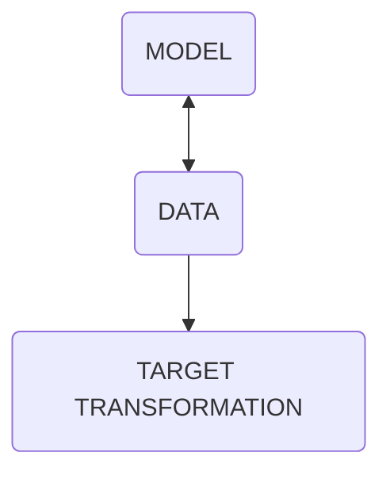

---
tags:
  - class
unit: 8
date: 231002
---
|  |               |                        |
| ---------------------------------------- | :------------ | ---------------------: |
| **class 08**                             | Feb 2nd, 2024 | *internet music 23/24* |

# Machine Learning - text

---

# Qu'est-ce que l'apprentissage automatique ?

> Le domaine de l'apprentissage automatique s'intéresse à la question de savoir comment construire des programmes informatiques qui s'améliorent automatiquement avec l'expérience. T./ Mitchell, 1997, Apprentissage automatique
---
## ML is a subset of IA
---
#### ISORYTHMIC MOTET RECOGNIZER

note:Prenons un exemple, imaginons que vous vouliez écrire un programme pour reconfigurer un motet isoritmique à partir d'un choral ou d'une pièce vocale du 19ème siècle.
3.  Si vous voulez écrire ce programme en utilisant les techniques de programmation traditionnelles, votre programme va devenir excessivement complexe. Vous devrez élaborer de nombreuses règles pour définir des courbes spécifiques, des règles et des exceptions à ces règles, des classes de hauteur, des motifs rythmiques, des analyseurs de paroles et des comparateurs pour déterminer s'il s'agit d'une composition du XVIe ou du XIXe siècle. Mais si je vous donne une seule voix parmi les quatre ou plus, votre programme ne fonctionnera pas et vous devrez le réécrire.
4.  Pour résoudre ce type de problèmes, nous utilisons le ML.
5.  En ML, nous construisons un modèle ou un moteur et nous lui donnons beaucoup de données.
6.  Par exemple, nous lui donnons des milliers ou des dizaines de milliers d'enregistrements de motets et de musique vocale. Ou mieux encore, des fichiers midi.
7.  Notre modèle va alors trouver et apprendre des modèles et des données d'entrée, de sorte que nous pouvons lui donner une nouvelle partition de n'importe quel style qui n'était même pas dans la base de données, et lui demander si c'est un motet ou un lied ou quel type de technique est utilisé. Et il nous répondra avec un certain niveau de précision que plus nous lui donnons de données d'entrée, plus notre modèle sera précis.
8.  Il y a beaucoup de fantaisie mais aussi des implications politiques, sociales, économiques, morales et éthiques à dire qu'un programme apprend.
9.  Le premier axiome du ML est le suivant : les performances d'un programme s'améliorent au fur et à mesure que l'expérience s'accroît.
10.  Expérience signifie ici données, en quantité et en qualité ← IA centrée sur les données. Beaucoup de très bonnes données.
11.  Notre première tâche est donc d'apprendre à construire un bon ensemble de données ou une bonne collection en trois étapes : collecter, gérer et traiter.
Quelques exemples de l'état actuel de la ML et de l'art, et de la production médiatique .
---
la performance d'un programme **<mark style="background: #ABF7F7A6;">améliore</mark>** en tant qu'expérience **<mark style="background: #BBFABBA6;">se développe</mark>**.

---

### Processus ML

1. DATA   /dataset 
2. DATA CLEANING
	1. TRAINING and 
	2. TEST sets
3. MODEL CREATION
 1. MODEL TRAINING
 2. EVALUATION & IMPROVEMENT
  1. temperature

note:1. le ML implique un certain nombre d'étapes, la première étape consiste à importer nos données qui se présentent souvent sous la forme d'un fichier .csv, ou mieux connu sous le nom de **dataset**.
2.  Ensuite, nous devons **nettoyer** les données. Cela implique des tâches telles que les données dupliquées, les données non pertinentes, incomplètes ou bruyantes.
3.  Une fois les données nettoyées, nous devons les diviser en deux segments : **entraînement** et **ensembles de test** pour s'assurer que notre modèle produit les bons résultats. Par exemple, si vous disposez de la collection des 380 chorals de Bach, nous pouvons en réserver 300 pour l'entraînement et 80 pour le test (80-20 %).
4.  L'étape suivante consiste à **créer un modèle**, ce qui implique de sélectionner un algorithme pour analyser les données. Il existe de nombreux algorithmes d'apprentissage automatique, tels que les arbres de décision, les réseaux neuronaux, etc. Chaque algorithme présente des avantages et des inconvénients en termes de précision et de performance. L'algorithme que vous utilisez dépend donc du type de problème que vous essayez de résoudre et de vos données d'entrée.
5.  Ensuite, nous devons **entraîner le modèle**. Nous lui transmettons donc nos données d'entraînement. Au cours de cette étape, notre modèle recherchera des modèles dans les données, de sorte que nous pourrons ensuite lui demander de faire des prédictions. Pour en revenir à notre exemple de reconnaissance de motet, en donnant un en-tête de quelques hauteurs (un thème partiel d'une exposition), notre modèle peut prédire des continuités potentielles en se basant sur son entraînement. Bien sûr, cette prédiction n'est pas toujours exacte.
6.  Cette mesure de la prédiction est l'étape **d'évaluation et d'amélioration**, et dans de nombreux algorythmes, vous trouverez une mesure de cette précision appelée _**température**._
---

##  Forevere
<iframe src="https://m.twitch.tv/watchmeforever" allow="fullscreen" allowfullscreen="" style="height:100%;width:100%; aspect-ratio: 16 / 9; "></iframe>

---

## GPT-4

ce qu'il faut savoir sur le gpt-4

1. est un **modèle** multimodal à grande échelle qui accepte des images et du texte en entrée et produit du texte en sortie.
2. Il présente des performances de niveau humain sur divers critères de référence professionnels et académiques.
3. Il s'agit d'un modèle basé sur un transformateur, pré-entraîné pour prédire le prochain élément d'un document.
4. Le processus d'alignement post-formation se traduit par une amélioration des performances en termes de factualité et de respect du comportement souhaité.
5. Ce réglage fin utilise l'apprentissage par renforcement à partir du retour d'information humain (RLHF).

---

--- 
<iframe src="https://twitter.com/BMaursky/status/1747700852226199815" allow="fullscreen" allowfullscreen="" style="height:100%;width:100%; aspect-ratio: 16 / 9; "></iframe>
---

<iframe title="AI FILM -The Carnival of the Ages - Runway gen2" src="https://www.youtube.com/embed/q0EDV1HGbrc?feature=oembed" height="150" width="200" allowfullscreen="" allow="fullscreen" style="aspect-ratio: 1.33333 / 1; width: 100%; height: 100%;"></iframe>

---

# Modèles de langue Largue

Quelques hypothèses
1. la grande majorité des tâches de raisonnement peuvent être efficacement exprimées et évaluées en langage.
2. l'apprentissage non supervisé est effectué en fournissant le texte du monde et le processus de modélisation générative.
3. L'ensemble de données WebText original était un scrape web de liens sortants de reddit jusqu'en décembre 2017 (recevant au moins 3 karma).
4. WebText 2 a ajouté les liens de janvier à octobre 2018. (96 GO)
5. Plus tard, un corpus de livres a été ajouté, Common Crawl, Wikipedia en anglais et des livres Internet accessibles au public.

---
1. Depuis 2020, il y a un nouveau modèle chaque mois :

	1. GPT-2
	2. BERT
	3. GPT-3(175B)
	4. LaMDA (137B)
	5. Jurassic-1(178B)
	6. Megatron-Turing NLG (530B)
	7. Gopher(280B)

---
Dans un nouvel article ("Training Compute-Optimal Large Language Models" par Hoffmann et al.), les chercheurs de DeepMind ont réexaminé les conclusions de Kaplan et ont constaté que l'augmentation du nombre de jetons d'entraînement (c'est-à-dire la quantité de données textuelles avec lesquelles le modèle est alimenté) est aussi importante que l'augmentation de la taille du modèle.

---

5. compte tenu d'un budget de calcul fixe, les chercheurs doivent l'allouer dans des proportions similaires pour augmenter la taille du modèle et le nombre de jetons d'entraînement afin d'atteindre le modèle de calcul optimal (tel que mesuré par la perte d'entraînement minimale). "Pour chaque doublement de la taille du modèle, le nombre de jetons d'entraînement devrait également doubler". Cela signifie qu'un modèle plus petit peut largement surpasser un modèle plus grand - mais sous-optimal - s'il est entraîné avec un nombre significativement plus élevé de jetons.

---
Chinchilla, un modèle de 70B paramètres 4 fois plus petit que le précédent leader de l'IA du langage, Gopher (également construit par DeepMind), mais entraîné sur 4 fois plus de données.

---
Ainsi, désormais, la qualité du NLM se mesure à la fois en taille (nombre de paramètres) et en tokens d'entraînement.

---
Pendant ce temps, LaMDA a 137B mais 168B tokens d'entraînement, Chichilla a 70B et 1.4T tokens d'entraînement.

---

# prompting 

		1. increpemental prompt.
			1. Establish CONTEXT
			2. Explain the TOPIC
			3. Specify the TASK
			4. Ask follow-up question.
			5. Assume for AI a character or specific role, ex " YOU ARE ...."
				(fine tuning)
				6. Specify the TARGET  (lilypond)

---
## <mark class="hltr-blue">important</mark> données pour connaître l'architecture sous-jacente de LLM

--
### **Contextes**
Dans les grands modèles linguistiques (LLM), les contextes font référence aux situations ou scénarios spécifiques sur lesquels un modèle est entraîné.
sur lequel un modèle est formé. Ces contextes peuvent être considérés comme des "sacs" contenant des informations pertinentes pour une tâche particulière,
comme la classification de textes ou la réponse à des questions. Le modèle apprend à reconnaître les modèles et les relations au sein de ces contextes afin de faire des prédictions ou de répondre à des questions.
dans ces contextes afin de faire des prédictions ou de générer des réponses.

--
### **Coupure des connaissances**
Ce terme fait référence à la date jusqu'à laquelle les données d'apprentissage d'un modèle sont à jour. Par exemple, si un
a été formé jusqu'en 2022, son seuil de connaissance sera 2022. Cela signifie que le modèle peut ne pas avoir
Cela signifie que le modèle peut ne pas avoir été exposé à des événements, des tendances ou une terminologie plus récents, ce qui peut avoir un impact sur ses performances sur des textes plus récents.

--
### **Tokens préformés** Les tokens préformés sont des enchâssements de mots appris à partir de grandes quantités de données textuelles avant d'être affinés pour une tâche spécifique.
avant d'être affinés pour une tâche spécifique. Ces encastrements représentent les mots comme des vecteurs denses dans un espace à haute dimension,
Ces encastrements représentent les mots comme des vecteurs denses dans un espace à haute dimension, capturant leurs relations sémantiques et leurs significations dépendantes du contexte. Cette étape de pré-entraînement permet aux modèles de
d'exploiter les connaissances linguistiques générales et de les transférer aux tâches en aval.

--
### **Instructions affinées**
La mise au point consiste à ajuster les paramètres du modèle sur la base d'un ensemble de données plus restreint et spécifique à la tâche.
de données plus petit et spécifique à la tâche. Les instructions pour le réglage fin peuvent inclure des objectifs spécifiques, tels que l'estimation du maximum de vraisemblance ou la modélisation du langage masqué.
la modélisation du langage masqué. Ces instructions aident à guider le processus d'apprentissage du modèle, lui permettant de s'adapter à de nouveaux contextes et à de nouvelles tâches tout en conservant ses connaissances générales.
nouveaux contextes et tâches tout en conservant ses connaissances générales.

--
### **Dimensions LLM**
Les dimensions LLM se réfèrent au nombre d'unités (par exemple, les neurones) dans une couche particulière au sein d'une architecture LLM.
d'une architecture LLM. Par exemple, un modèle peut avoir 256 dimensions d'encastrements d'entrée ou 1024 dimensions d'états cachés.
Ces dimensions influencent la capacité de représentation du modèle et sa capacité à capturer des relations complexes entre les entrées.
les entrées.

--
### **Taille du vocabulaire**
La taille du vocabulaire représente le nombre de mots ou d'éléments uniques sur lesquels un modèle est formé. A
vocabulaire plus important signifie généralement que le modèle a été exposé à des modèles de langage, des idiomes et des expressions plus variés, ce qui lui permet de mieux s'adapter à des textes inédits,
et expressions, ce qui lui permet de mieux s'adapter à des textes inédits.

--
### **Couche de sortie**
la couche finale d'une architecture LLM chargée de générer des prédictions ou des réponses.
ou des réponses. Cette couche peut être conçue pour diverses tâches, telles que la classification, la régression ou la génération. La conception et la taille de la couche de
La conception et la taille de la couche de sortie peuvent avoir un impact significatif sur la performance d'un modèle sur des tâches spécifiques et sur sa capacité à produire des résultats cohérents et pertinents.
produire des résultats cohérents et pertinents.

--
### **Batch size**
il s'agit du nombre d'exemples d'entrée (par exemple, des échantillons de texte) traités en parallèle par le modèle au cours de l'apprentissage.
par le modèle pendant l'apprentissage. Une taille de lot plus importante peut accélérer la formation, mais peut également augmenter l'utilisation de la mémoire et le temps de calcul.
mémoire et le temps de calcul.

--
### **Optimizer**
Un optimiseur est un algorithme qui ajuste les paramètres du modèle en fonction de la fonction de perte et du taux d'apprentissage.
taux d'apprentissage. Les optimiseurs les plus courants sont Adam, SGD, RMSProp et Adagrad.

--
### **Learning rate**
il contrôle la vitesse à laquelle le modèle apprend des données. Un taux d'apprentissage élevé peut
d'apprentissage élevé peut conduire à une convergence plus rapide, mais peut également entraîner un dépassement ou des oscillations. Un taux d'apprentissage faible peut garantir
des mises à jour stables mais peut ralentir l'apprentissage.

--
### **Regularization**
comme la régularisation L1 et L2, permettent d'éviter les surajustements en ajoutant un terme de pénalité à la fonction de perte.
en ajoutant un terme de pénalité à la fonction de perte. Cela encourage le modèle à apprendre des représentations plus simples qui se généralisent mieux.
meilleure généralisation.

--
### **Dropout**
technique de régularisation qui supprime aléatoirement des neurones pendant la formation
de l'apprentissage afin d'éviter une dépendance excessive à l'égard des caractéristiques individuelles. Cela permet d'améliorer la robustesse et les capacités de généralisation.

--
### **Weight decay**
également connue sous le nom de régularisation L2, ajoute un terme de pénalité à la fonction de perte en fonction de l'ampleur des poids du modèle.
l'ampleur des poids du modèle. Cela encourage le modèle à apprendre des poids plus petits et plus stables qui
qui généralisent mieux.

--
### **Layer normalization** 
une technique qui normalise les activations de chaque couche avant de les
avant de passer à la couche suivante. Cela permet de stabiliser l'entraînement et d'améliorer les performances.

--
### **Embedding size**
The embedding size refers to the dimensionality of the word embeddings learned by the model. A
larger embedding size can capture more nuanced semantic relationships, but may also increase computation time and
memory usage.

--
### **Attention mechanism** 
La taille de l'intégration fait référence à la dimensionnalité des intégrations de mots apprises par le modèle. A
plus grande peut capturer des relations sémantiques plus nuancées, mais peut aussi augmenter le temps de calcul et l'utilisation de la mémoire.
l'utilisation de la mémoire.

--
### **Maximum sequence length**
il limite la plus longue séquence d'entrée possible que le modèle peut traiter.
peut traiter. Ceci est important pour traiter les dépendances à longue portée et garantir l'efficacité des calculs.

---
- contexts
- knowlesge cutoff
- pretrained tokens
- fine-tuned instructions
- LLM dimensions
- Vocabulary size
- Output layer
- Batch size
- Optimizer
- Learning rate 
- Regularization
- Dropout
- Weight decay
- Layer normalization
- Embedding size
- Attention mechanism
- Maximum sequence lenght
