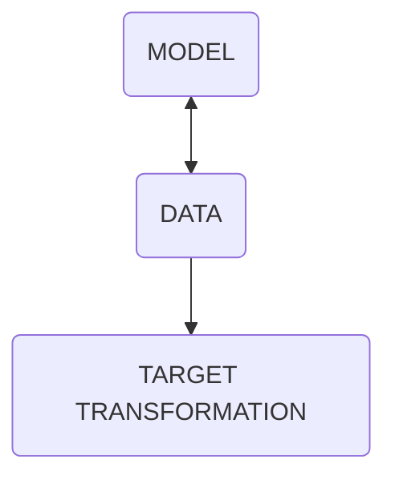

---
tags:
  - class
unit: 8
date: 231002
---
|  |               |                        |
| ---------------------------------------- | :------------ | ---------------------: |
| **class 08**                             | Feb 2nd, 2024 | *internet music 23/24* |

# Machine Learning - text

---

# What is Machine Learning?

> The field of machine learning is concerned with the question of how to construct computer programs that automatically improve with experience. T./ Mitchell, 1997, Machine Learning
---
## ML is a subset of IA
---
#### ISORYTHMIC MOTET RECOGNIZER

note:Lets go for an example, imagine that you want to write a program to reconigze an isoritmitc motet from a a choral or a 19th vocal piece.
3.  If you want to write this program using traditional programming techniques, your program is goint to get overly complex. You will have to come up with lots of rules to come up with specific curves, rules and exceptions to these rules, pitch classes, rhytmical patterns , lyric parsers an comparers to tell if it’s a composition from XVI or XIX century. But then If I give you , just one voice of the four or more, your program would not work and you would have to rewrite it.
4.  To solve the this type of problems we use ML.
5.  In ML we build a model or an engine and give it lots and lots of data.
6.  For example we give it thousands or ten of thousands of recordings of motets and vocal music. Or even better , midi files.
7.  Our model will then find and learn patterns and the input data, so we can give it a new score of any style that even wasn’t in the database, and ask it, is it a motet or is a lied or what kind of technique is using. And it will tell us with a certain level of accuracy the more input data we give it, the more accurate our model is going to be.
8.  There is a lot of phantasy but also political, social, economical, moral, and ethical implications of saying that a program learns.
9.  The first axiom of ML is : the performance of a programme improves as experience grows.
10.  Experience here means data, in quantity and in quality ← Datacentric IA. A lot of very good data.
11.  So the our first task is to learn how to build a good data-set or collection in three stages: to collect, handle, and process.
Some examples of the actual state of ML and art, and media production .
---
the performance of a programme **<mark style="background: #ABF7F7A6;">improves</mark>** as experience **<mark style="background: #BBFABBA6;">grows</mark>**.

---

### ML processes

1. DATA   /dataset 
2. DATA CLEANING
	1. TRAINING and 
	2. TEST sets
3. MODEL CREATION
 1. MODEL TRAINING
 2. EVALUATION & IMPROVEMENT
  1. temperature

note:1.  So ML involves a number of steps, the first step is to import our data which often comes in the form of a .csv file, or better known as **dataset**.
2.  Next, we need th **clean** the data. And this involves tasks such as duplicated data, irrelevant, incomplete or noisy data.
3.  Once data is clean, we need to split the data into two segments: **training** and **test sets** to make sure that our model produces the right result. For example if you have the collection of the 380 Bach chorals we can reserve 300 for training and 80 for testing (80-20%).
4.  The next step is to **create a model** and this involves selecting an algorithm to analyse the data. There are so many machine learnings algorithms out there, such as decision trees, neural networks and so on. Each algorithm have pros and cons in terms of accuracy and performance so the algorithm you use, depends on the kind of problem you’re trying to solve and your input data.
5.  Next we need to **train the model**. So we feed it our training data. On this step our model will then look for the patterns in the data, so next we can ask it to make predictions. Coming back to our motet recognition exanple, giving a header of few pitches (a partial theme of a exposition), our model can predict potential continuities based on its train. Of course, this prediction is not always accurate.
6.  This measurement of the prediction is the **evaluation and improvement** stage, and in many algorythms you will find a measure of this accuracy called _**temperature**._
---

##  Forevere
<iframe src="https://m.twitch.tv/watchmeforever" allow="fullscreen" allowfullscreen="" style="height:100%;width:100%; aspect-ratio: 16 / 9; "></iframe>

---

## GPT-4

what to know about gpt-4

1. is a large-scale multimodal **model** which accepts images and text inputs and produce text outputs.
2. It exhibits human-level performance on various professional and academic benchmarks
3. Is a transformer-based model pre-trained to predict the next token in a document.
4. The post-training alignment process results in improved performance on measures of factuality and adherence to desired behaviour.
5. This Fine-tuned usess Reinforcement Learning from Human Feedback (RLHF)

---

--- 
<iframe src="https://twitter.com/BMaursky/status/1747700852226199815" allow="fullscreen" allowfullscreen="" style="height:100%;width:100%; aspect-ratio: 16 / 9; "></iframe>
---

<iframe title="AI FILM -The Carnival of the Ages - Runway gen2" src="https://www.youtube.com/embed/q0EDV1HGbrc?feature=oembed" height="150" width="200" allowfullscreen="" allow="fullscreen" style="aspect-ratio: 1.33333 / 1; width: 100%; height: 100%;"></iframe>

---

# Largue language Models

some assumptions
1. the bast majority of reasoning tasks can be efficiently expressed and evaluated in language.
2. the unsupervised learning is done by providing world's text and proccess making generative modeling.
3. The original WebText dataset was a web scrape of outbounds links from reddit through Deember 2017 (receiving at least 3 karma)
4. WebText 2 adde Jan-Oct 2018 links. (96 GB)
5. Later, a Books Corpus was added, Common Crawl, English Wikipedia and publicly-availabe Internet Books.

---
1. Since 2020 there is a new model every month:

	1. GPT-2
	2. BERT
	3. GPT-3(175B)
	4. LaMDA (137B)
	5. Jurassic-1(178B)
	6. Megatron-Turing NLG (530B)
	7. Gopher(280B)

---
In a new paper ("Training Compute-Optimal Large Language Models" by Hoffmann et al.), DeepMind researchers revisited Kaplan's findings and found that scaling the number of training tokens (i.e., the amount of text data with which the model is fed) is as important as scaling the size of the model.

---

5.Given a fixed computational budget, researchers must allocate it in similar proportions to increase the model size and the number of training tokens to reach the optimal computational model (as measured by the minimum training loss). "For every doubling of the model size, the number of training tokens should also double." This implies that a smaller model can vastly outperform a larger - but suboptimal - model if trained with a significantly larger number of tokens.

---
Chinchilla, a 70B-parameter model 4 times smaller than the previous leader in language AI, Gopher (also built by DeepMind), but trained on 4 times more data.

---
So, now, the quality of the NLM are measured both in size (number of parameters) as in training tokens. 

---
Meanwhile LaMDA have 137B but 168B training tokens, Chichilla has 70B and 1.4T training tokens.

---

# prompting 

		1. increpemental prompt.
			1. Establish CONTEXT
			2. Explain the TOPIC
			3. Specify the TASK
			4. Ask follow-up question.
			5. Assume for AI a character or specific role, ex " YOU ARE ...."
				(fine tuning)
				6. Specify the TARGET  (lilypond)

---
## <mark class="hltr-blue">important</mark> data to know the underlying architecture of LLM

--
### **Contexts**
In Large Language Models (LLMs), contexts refer to the specific situations or scenarios that a model
is trained on. These contexts can be thought of as "bags" that contain relevant information for a particular task,
such as text classification or question answering. The model learns to recognize patterns and relationships within
these contexts to make predictions or generate responses.

--
### **Knowledge cutoff**
This term refers to the date up to which a model's training data is current. For example, if a
language model was trained until 2022, its knowledge cutoff would be 2022. This means that the model may not have
been exposed to more recent events, trends, or terminology, which can impact its performance on newer texts.

--
### **Pretrained tokens** Pretrained tokens are word embeddings learned from large amounts of text data before being
fine-tuned for a specific task. These embeddings represent words as dense vectors in a high-dimensional space,
capturing their semantic relationships and context-dependent meanings. This pretraining step allows models to
leverage general linguistic knowledge and transfer it to downstream tasks.

--
### **Fine-tuned instructions**
Fine-tuning involves adjusting the model's parameters based on a smaller, task-specific
dataset. Instructions for fine-tuning can include specific objectives, such as maximum likelihood estimation or
masked language modeling. These instructions help guide the model's learning process, allowing it to adapt to new
contexts and tasks while maintaining its general knowledge.

--
### **LLM dimensions**
LLM dimensions refer to the number of units (e.g., neurons) in a particular layer within an LLM
architecture. For instance, a model might have 256-dimensional input embeddings or 1024-dimensional hidden states.
These dimensions influence the model's representation capacity and ability to capture complex relationships between
inputs.

--
### **Vocabulary size**
Vocabulary size represents the number of unique words or tokens that a model is trained on. A
larger vocabulary size typically means that the model has been exposed to more diverse language patterns, idioms,
and expressions, allowing it to generalize better to unseen texts.

--
### **Output layer**
the final layer in an LLM architecture responsible for generating predictions
or responses. This layer can be designed for various tasks, such as classification, regression, or generation. The
output layer's design and size can significantly impact a model's performance on specific tasks and its ability to
produce coherent, relevant outputs.

--
### **Batch size**
it refers to the number of input examples (e.g., text samples) processed in parallel by
the model during training. A larger batch size can accelerate training, but may also increase memory usage and
computation time.

--
### **Optimizer**
An optimizer is an algorithm that adjusts the model's parameters based on the loss function and
learning rate. Popular optimizers include Adam, SGD, RMSProp, and Adagrad.

--
### **Learning rate**
it controls how quickly the model learns from the data. A high learning rate can
lead to faster convergence but may also result in overshooting or oscillations. A low learning rate can ensure
stable updates but may slow down training.

--
### **Regularization**
such as L1 and L2 regularization, help prevent overfitting by adding
a penalty term to the loss function. This encourages the model to learn simpler representations that generalize
better.

--
### **Dropout**
regularization technique that randomly drops neurons during training to prevent
over-reliance on individual features. This helps improve robustness and generalization capabilities.

--
### **Weight decay**
also known as L2 regularization, adds a penalty term to the loss function based on
the magnitude of the model's weights. This encourages the model to learn smaller, more stable weights that
generalize better.

--
### **Layer normalization** 
a technique that normalizes the activations in each layer before
passing them through the next layer. This helps stabilize training and improve performance.

--
### **Embedding size**
The embedding size refers to the dimensionality of the word embeddings learned by the model. A
larger embedding size can capture more nuanced semantic relationships, but may also increase computation time and
memory usage.

--
### **Attention mechanism** 
it allows the model to focus on specific parts of the inputwhen generatingg outputs or making predictions. This can be especially useful for tasks like machine translation or
question answering.

--
### **Maximum sequence length**
it limits the longest possible input sequence that the model
can process. This is important for handling long-range dependencies and ensuring computational efficiency.

---
- contexts
- knowlesge cutoff
- pretrained tokens
- fine-tuned instructions
- LLM dimensions
- Vocabulary size
- Output layer
- Batch size
- Optimizer
- Learning rate 
- Regularization
- Dropout
- Weight decay
- Layer normalization
- Embedding size
- Attention mechanism
- Maximum sequence lenght
