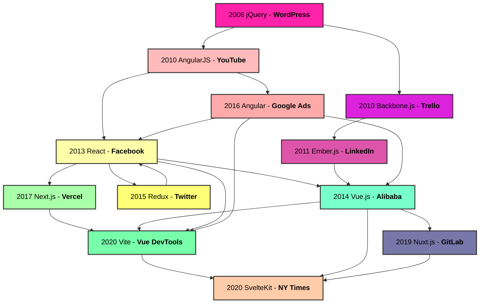

---
tags:
  - class
unit: 2
date: 231002
---
|  |               |                        |
| ---------------------------------------- | :------------ | ---------------------: |
| **class 04**                             | Nov 8th, 2024 | *internet music 24/25* |
### class 04
# Component-Based Architectures
---
- **Definition**: Modular approach where each part of the UI is built as an independent *component*.
- **Structure**: Components can be nested, reused, and managed independently.
--
## Reusability
- **Pro**: Components are self-contained and can be reused across the application, saving development time.
- **Con**: Initial setup may require more planning to ensure components are flexible and reusable.
--
## Separation of Concerns
- **Pro**: Each component encapsulates its structure, style, and behavior.
- **Con**: Vanilla JavaScript may result in simpler files without a need for breaking everything into components.
--
## Maintainability
- **Pro**: Modular components make it easy to locate, update, and test individual parts of the UI.
- **Con**: Component-based architectures can add complexity, especially in small projects.
--
## Scalability
- **Pro**: Components simplify the development of large applications by isolating logic and UI elements.
- **Con**: For simple, static sites, the overhead of managing components may be unnecessary.
--
## Improved Testing
- **Pro**: Isolated components are easier to test individually, promoting a TDD approach.
- **Con**: Traditional sites may rely on end-to-end tests rather than isolated unit tests, simplifying some workflows.
--
## Consistency
- **Pro**: Shared components help maintain consistent design and behavior across the application.
- **Con**: Vanilla JavaScript sites may need more manual work to ensure consistency across the UI.
--
## State Management
- **Pro**: Component-based architecture allows state to be managed at different levels, promoting efficient data handling.
- **Con**: Managing state in complex applications can lead to “prop drilling” or require libraries like Redux for scalability.
--
## Performance (Virtual DOM)
- **Pro**: React, Vue, and others use virtual DOM to optimize re-rendering, making updates faster.
- **Con**: Vanilla JavaScript interacts with the real DOM directly, which can be simpler but less efficient with large UIs.
--
## Learning Curve
- **Pro**: Component-based architecture promotes modern patterns like reusable code and modularity.
- **Con**: Learning frameworks like React or Vue adds complexity for developers familiar only with Vanilla JavaScript.
--

note:1. **jQuery (2006)**: Simplified DOM manipulation, paving the way for JavaScript’s widespread use.
2. **AngularJS (2010)**: Introduced two-way data binding and MVC patterns in JavaScript.
3. **Backbone.js (2010)**: Emphasized MVC architecture and offered simple data-binding for early apps.
4. **Ember.js (2011)**: Built on MVC concepts with conventions for building ambitious applications.
5. **React (2013)**: Revolutionized with a component-based architecture and the Virtual DOM.
6. **Vue.js (2014)**: Combined Angular’s reactivity with React’s component-based model in a more lightweight framework.
7. **Redux (2015)**: Inspired by Flux, added predictable state management for complex React apps.
8. **Angular (2016)**: A complete rewrite of AngularJS, adopting a component-based architecture.
9. **Next.js (2017)**: Brought server-side rendering and static generation to React applications.
10. **Vite (2020)**: Developed by the creator of Vue, introduced faster development with an ES module-based dev server.
11. **SvelteKit (2020)**: Combined Svelte’s compilation approach with a full-fledged application framework for SSR and static generation.
---

---

# vite
![[vite]]

--- 
