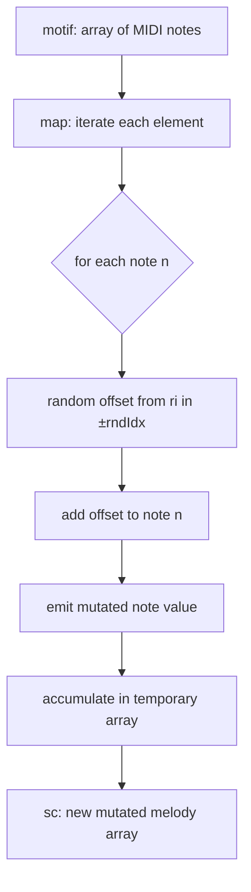
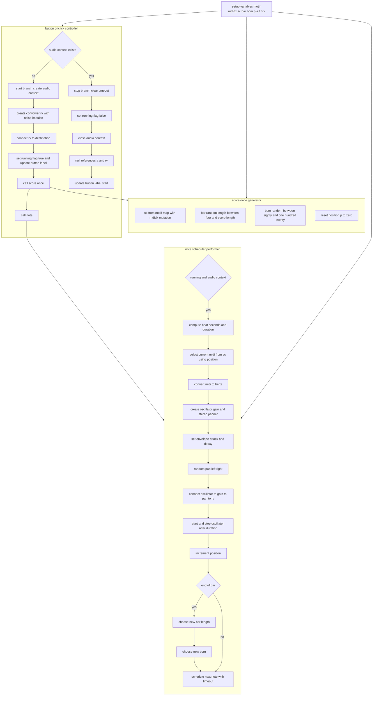

```dataviewjs
// Class 03 — one-shot random melody → loop with random length & tempo (80–120 BPM) + reverb + random pan
const btn=document.createElement('button'); btn.textContent='▶ play'; this.container.appendChild(btn);
// user params
const motif=[60,62,65,67,69,67,65,62]; // MIDI
const rndIdx=2;                        // ± semitone mutation once
let a=null,t=null,f=false,sc=[],bar=0,bpm=0,p=0,rv=null;
const hz=m=>440*Math.pow(2,(m-69)/12);
const ri=(lo,hi)=>(Math.random()*(hi-lo+1)|0)+lo; // | bitwise truncation 
function scoreOnce(){
  sc=motif.map(n=>n+ri(-rndIdx,rndIdx));
  bar=ri(4,Math.max(4,sc.length));
  bpm=ri(80,120);
  p=0;
}
function note(){
  if(!f||!a) return;
  const beat=60/bpm, dur=beat*0.9;
  const m=sc[p%sc.length], fr=hz(m);
  const o=a.createOscillator(), g=a.createGain(), pan=a.createStereoPanner();
  o.type='sine'; o.frequency.value=fr;
  g.gain.setValueAtTime(0.0001,a.currentTime);
  g.gain.linearRampToValueAtTime(0.15,a.currentTime+0.01);
  g.gain.exponentialRampToValueAtTime(0.0001,a.currentTime+dur);
  pan.pan.value=ri(-10,10)/10; // random L/R
  o.connect(g).connect(pan).connect(rv);
  o.start(); o.stop(a.currentTime+dur);
  p++;
  if(p%bar===0){ bar=ri(4,Math.max(4,sc.length)); bpm=ri(80,120); }
  t=setTimeout(note, beat*1000);
}
btn.onclick=async()=>{
  if(!a){
    a=new (window.AudioContext||window.webkitAudioContext)(); await a.resume();
    // reverb
    rv=a.createConvolver();
    const b=a.createBuffer(2,(a.sampleRate*1.2)|0,a.sampleRate);
    for(let c=0;c<2;c++){const d=b.getChannelData(c);for(let i=0;i<d.length;i++) d[i]=(Math.random()*2-1)*(1-i/d.length);}
    rv.buffer=b; rv.connect(a.destination);
    f=true; btn.textContent='■ stop'; scoreOnce(); note();
  }else{
    f=false; if(t){clearTimeout(t); t=null;}
    try{await a.close();}catch(e){}
    a=null; rv=null; btn.textContent='▶ play';
  }
};
```
# flow

---



---

## Concepts
- motif: base melody as MIDI integers
- sc: mutated score arra  y
- map: array transformation per element
- n: current note value
- ri(a,b): random integer in closed interval
- rndIdx: maximum semitone deviation
- mutation: add random offset to note
- immutability: map creates a new array
- randomness: different result each run
- bounded variation: changes limited by rndIdx

### Steps
- Read motif as input array
- Start map over motif elements
- Take current note n
- Generate random offset with ri
- Offset bounded by ±rndIdx
- Add offset to note n
- Produce mutated note value
- Append mutated note to result
- Repeat for every motif element
- Finish with new array sc


## Concepts

1. Start/stop button toggles an AudioContext instance, ensuring proper creation, scheduling, and full teardown to avoid resource leaks.
2. motif is an initial melody in MIDI numbers, defining the tonal seed before any stochastic mutation or structural looping decisions.
3. rndIdx sets maximum semitone deviation; each motif note mutates within ±rndIdx once, producing a fixed randomized score.
4. sc stores the finalized score after mutation; performance repeatedly references sc without regenerating notes every loop cycle.
5. ri(lo,hi) returns a random integer within bounds, driving semitone mutation, bar length changes, and tempo reselection.
6. hz(m) converts MIDI to Hertz with 440·2^((m−69)/12), mapping discrete pitch classes to oscillator frequency values.
7. bar represents current phrase length in notes; after completing a bar, the system chooses a new random phrase length.
8. bpm is randomized between 80 and 120; the scheduler converts beats to seconds by using 60 divided by bpm.
9. beat duration equals 60/bpm; note envelope occupies slightly less than a beat, creating breathing space between successive sounds.
10. note() schedules itself recursively with setTimeout, achieving non-blocking sequencing aligned to the current random tempo.
11. Each note instantiates a fresh OscillatorNode and GainNode, enabling per-note amplitude shaping without shared-state artifacts.
12. Envelope uses zero attack with linear ramp, then exponential decay near duration end, preventing clicks and leaving reverb tails.
13. StereoPanner introduces per-note random pan between left and right channels, widening spatial impression without additional modulation complexity.
14. Convolver implements algorithmic reverb using a noise impulse response, decaying to zero to preserve transparency and simplicity.
15. rv.connect(destination) places reverb at the graph end; per-note chains connect oscillator to gain, panner, then reverb.
16. A running flag f prevents scheduling when stopped, ensuring asynchronous callbacks exit gracefully without touching closed contexts.
17. A timeout handle t allows canceling pending note scheduling immediately during stop, avoiding late triggers after teardown.
18. On stop, the code clears t, closes the AudioContext, nulls references, and resets UI label to start state.
19. Mutation happens once per playback session, separating composition-time randomness from performance-time tempo and form variability.
20. Randomized bar and tempo at phrase boundaries model formal breathing, avoiding strictly periodic mechanical repetition patterns.
21. Using per-note nodes is minimalistic; garbage collection reclaims short-lived nodes after stop time without manual disconnect complexity.
22. Sine waveform provides neutral timbre for pitch focus; swapping type enables quick spectral experiments without algorithm changes.
23. Determinism can be introduced by replacing ri with a seeded RNG, enabling repeatable experiments and comparative listening tests.
24. Structure balances fixed score identity with variable pacing and segmentation, aligning compositional stability with performative contingency.


### bitwise integer truncation 

```js
(3.9 | 0) === 3;
(3.9 ^ 0) === 3;
(3.9 >> 0) === 3;
```

It’s elegant but not perfectly equivalent to Math.floor() for **negative** numbers —
|0 truncates toward zero, not toward −∞.
```js
(-1.9 | 0)  // → -1
Math.floor(-1.9) // → -2
```


### arrow function as "function operator'

```js
 sc=motif.map(n=>n+ri(-rndIdx,rndIdx));
```

 =
 
```js
  motif.map(function(n) {
  return n + ri(-rndIdx, rndIdx);
});
```

motif.map(...)
→ calls the **Array.map()** method, which applies a function to every element of the array and returns a new array.
`n => n + ri(-rndIdx, rndIdx)`
→ is an **arrow function** — a compact way to define an ***anonymous*** function.

---


---





˛