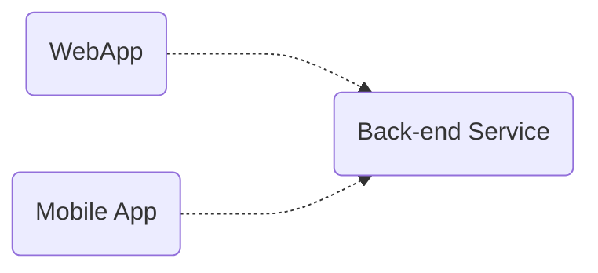

#technologies 

# Node.js

# HEADLESS BROWSER

WEB-CRAWLING
DATA-MINING
MUSIC INFORMATION RETRIEVAL
AUTOMATED CHATS
DOWNLOAD MASSIVE FILES FROM SITES

- Node.js is a JavaScript runtime built on Chrome's V8 JavaScript engine.
- Its executen JavaScript code outside the browser.
- Usually used to build back API (or application Programming Interfaces),
- these interfaces usually maintain the front apps as web apps, mobile apps , browser etc.



- At difference than Angular, Next, or Django, Node.js is easy to get started and great for prototyping and development.
- Node.js let use use JS into the back-end.
- Finally, it have the larger ecosystem of open-source libs

To catch up the concept very quickly:

Before node, you need a language to write frontend apps (browser) and other for backend (servers) as perl, php.

So , in 2009 Ryan Dahl came up with an idea of running JS outside the browser, taking the engine outside a browers and putting into a normal C++ program. This program is called **Node**

But also has certain objects that provide an environment for JS code.

As this environment is different of those one in browsers, they also are called in a distinctive way:

```java
          "js"                                     "node.js"
 
document.getElementById(' ');     -->   fs.readFile()  / http.createServer()

```

## Installation

### Using Homebrew

```
brew install node
```

### Using Node Version Manager (nvm)

Download and install [nvm](https://github.com/nvm-sh/nvm) by running:

```
curl -o- <https://raw.githubusercontent.com/nvm-sh/nvm/v0.35.3/install.sh> | bash

```

or via Homebrew:

```
brew install nvm
```

Then download Node and select your version by running:

```
source ~/.bashrc        # source your bashrc/zshrc to add nvm to PATH
command -v nvm          # check the nvm use message
nvm install node        # install most recent Node stable version
nvm ls                  # list installed Node version
nvm use node            # use stable as current version
nvm ls-remote           # list all the Node versions you can install
nvm alias default node  # set the installed stable version as the default Node

```

See the [documentation](https://github.com/nvm-sh/nvm#installing-and-updating) for information.

## npm usage

To install a package:

```
npm install <package> # Install locally
npm install -g <package> # Install globally
```

To install a package and save it in your project's `package.json` file:

```
npm install <package> --save
```

To see what's installed:

```
npm list [-g]
```

To find outdated packages:

```
npm outdated [-g]
```

To upgrade all or a particular package:

```
npm update [-g] [<package>]
```

To uninstall a package:

```
npm uninstall [-g] <package>
```

### how to use node.js modules in the browser

```java
node i browserify
browserify target  destiny 
```