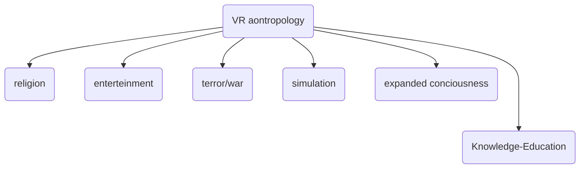

 #concept 

<iframe src="https://www.youtube.com/user/caitlinrowleymusic" allow="fullscreen" allowfullscreen="" style="height:100%;width:100%; aspect-ratio: 16 / 9; "></iframe>

# Introduction

- The term comes straight out of Neal Stephenson's 1980s novel Snowcrash. It is a cousin of William Gibson's term cyberspace, which became relatively important in the 1990s with the internet, although it was not used commercially.
- The term tries to define a transversal virtual reality platform where economy and leisure can be combined. Similar to what is seen in films like 'Ready Player One' (and its original book and many other CF books).
- Is not a new idea, you may remember Second Life. But with each iteration more solid attributes and technical possibilities are added. In this opportunity the new ones are blockchain and VR.
- It is an environment in which things are not what they are, but what they seem. But whose fiction has the limit of real dollars. The generation of 'virtualised and virtualising virtual economies' whose application is on platforms similar to video games.
- Between the tokenized games, three are those which have more possibilities to grow:
    - upland
        - buying lands and properties tied to real world
    - decentraland
    - the sandbox
- Other platforms more focused on einterteinment, in Lua allows users create own video games.
    - Roblox
        - created in 2004-06 by Erik Cassell and David Baszucki originally called DynaBlocks.
    - Rec Room
- Is it imaginable to deal with a dollarised, tokenised economy that is supported by a video game? Such a scenario is feasible and, even if the 'Metaverse' is not exactly realised, the vectors of development have a definite orientation. The 'gamification' of the economy and the Real World is a project.
- Fornite: **Live Events**  are events that occur within the match that connects to the [story line](https://fortnite.fandom.com/wiki/Lore_(Battle_Royale))  of Fortnite. They usually occur in the middle or near the end of the season. Some events involve turning off shooting, so everyone can enjoy the event. Sometimes, build is still enabled, so players can build up and get a better view. 4/23/2020 - Travis Scott

→ ver charla de Parlagreco [https://youtu.be/xWBCle5NKfQ?t=6295](https://youtu.be/xWBCle5NKfQ?t=6295)

Neil Postman

- 5 warnings
    
    - Culture pay a price for the technology: with the imaginary of artists, comes the training for remote war.
        
    - Massive surveillance
        
        - cambridge analytic: personal invasion, dystopic.
        - the helmet can track and scan data of your own room.
    - Media is message:
        
        - a comparition by Farocky, between the mental status of rehabilitaion afterwarsd by soldiers, images on the simulation doesn’t project shadows.
            
            [https://www.youtube.com/watch?v=TcKL-_RtU5Y](https://www.youtube.com/watch?v=TcKL-_RtU5Y)
            
    - Changes are ecological but additive
        
        [https://www.youtube.com/watch?v=afdnbXXbBTg](https://www.youtube.com/watch?v=afdnbXXbBTg)
        
    - A tendency to believe that media is mystical
        

# Ref Antropolohy of virtual reality

VR antropology

1. what is the emergency of the VR or hyperreality in the history of art:
    - Religion
        
        1. Villa of the Mysteries
            
            1. a bridge where gods enters into reality and humans enter in divinity.
                
                
                
            2. Apoteosis of San Ignacio
                
                
                
                It is a work by Andrea Pozzo, an Italian painter, architect and baroque art theorist, which seeks to represent the work carried out by the Jesuits in evangelising the world. The painting, 17 metres in diameter, merges with the architecture in such a way that when the observer looks at a point marked by a yellow copper disc, the ceiling ceases to exist to give way to a sky covered with clouds and angelic figures. It exalts the figure of Saint Ignatius of Loyola, who is placed at the centre of the composition.
                
                Pozzo's decorations set the standard for ceiling frescoes throughout Catholic Europe and were widely imitated in the churches of the Jesuit order in Italy, Austria, Germany and Central Europe. His work constitutes the final stage in the dissemination of the perspectival technique, through a teaching plan easily applicable to any field of architecture and painting, in which the optical-perceptual tradition and geometrical-mathematical mastery converge. Its legacy goes back to contemporary augmented, virtual and mixed reality devices, as well as the fulldome projection format.
                
                
                
            
            The Panorama of Sedan
            
            [Panorama de Sedán](https://proyectoidis.org/panorama-de-sedan/)
            
            War
            
    - War
        
        Phantasmagoria
        
        [https://en.wikipedia.org/wiki/Phantasmagoria](https://en.wikipedia.org/wiki/Phantasmagoria)
        
        World Skin
        
        [Maurice Benayoun: World Skin](https://digitalartarchive.siggraph.org/artwork/maurice-benayoun-world-skin/)
        
    - Entertainment
        
        - 1905 Kaiserpanorama
            
            stereoscopic diorama for 3D images with social engagement.
            
            [https://www.youtube.com/watch?v=IGuDN6SKMWg](https://www.youtube.com/watch?v=IGuDN6SKMWg)
            
        - Mareorama Hugo D’Alesi
            
            [https://alchetron.com/Mareorama](https://alchetron.com/Mareorama)
            
        - Cineorama
            
            [https://mediartinnovation.com/2014/05/21/raoul-gromoin-sanson-cineorama-1900/](https://mediartinnovation.com/2014/05/21/raoul-gromoin-sanson-cineorama-1900/)
            
        - Panoramas de MEsgad
            
            [https://proyectoidis.org/panorama-de-mesdag/](https://proyectoidis.org/panorama-de-mesdag/)
            
    - Simulation
        
        > instead of simply presenting the world, they show it in a dislocated way, until finally the human being begins to live according to the images created by himself. [...] Man forgets that he produces images in order to find his way in the world: now he tries to find his way with them. He no longer deciphers his own images, but lives according to them; imagination has become hallucination (Flusser, 2014: 15).
        
        - Villa de Livia
            
            [https://en.wikipedia.org/wiki/Villa_of_Livia](https://en.wikipedia.org/wiki/Villa_of_Livia)
            
        
        La figura de la naturaleza es el primer topos de la simulación.
        
        - Monet Nenufares
            
            
            
    - Education
        
        - Ken Issacs - Knowledge box
            
            [https://www.youtube.com/watch?v=v9uVf65bNgo](https://www.youtube.com/watch?v=v9uVf65bNgo)
            
        - Monika Fleischmann, Home of the Brain (1989-1992)
            
            [https://www.youtube.com/watch?v=uMAA6GYLJPU](https://www.youtube.com/watch?v=uMAA6GYLJPU)
            
        - Agnes Hegedüs - Memory Theatre VR (1997)
            
            Vr history in VR
            
            [https://www.youtube.com/watch?v=CULdlFpf45E](https://www.youtube.com/watch?v=CULdlFpf45E)
            

- Fake history on the -90
    - Sega VR
        
        [https://www.youtube.com/watch?v=3UN_pN9ZU8Y](https://www.youtube.com/watch?v=3UN_pN9ZU8Y)
        

## VR and expanded cinema

- Toshio Matsumoto → Takashi Ito
    
    [https://www.youtube.com/watch?v=616iYDR_j14](https://www.youtube.com/watch?v=616iYDR_j14)
    
- Char Davis
    
    [Osmose](http://www.immersence.com/osmose/)
    
- John Cage → HPSCHD
    
- Cerebrum (1968-1969)
    
    [https://www.youtube.com/watch?v=VjozaLBbrUs](https://www.youtube.com/watch?v=VjozaLBbrUs)
    
- StereoKino, Serguéi Eisenstein
    
- Stan Vanderbeek → 1968 Moviedrome [arte. → educacion)
    
    [http://www.medienkunstnetz.de/works/movie-drome/](http://www.medienkunstnetz.de/works/movie-drome/)
    
- Ken Issacks, (1977)
    
- Knowledge Box \Dialogue with the Knowbotic Sourh (1994-1997)
    

## art video games

### Ian Cheng —> Emissaries

### Joseph Delapp, Dead-In-Iraq → Videogames and performance

### Aram Bartholl, Dust scapes →in-gamephotography.

Eva & Franco Mattes→ Secondlife Portraits

### GAIA GamesArts international Assembly

[https://emreed.net/](https://emreed.net/)

## Three js examples

Edan Kwan

[https://particle-love.com/](https://particle-love.com/)

[https://www.operanorth.co.uk/turn-of-the-screw-immersive-trailer/#credits](https://www.operanorth.co.uk/turn-of-the-screw-immersive-trailer/#credits)

# Tone.js

final exercies

TIMING

[http://sites.music.columbia.edu/cmc/courses/g6611/spring2018/week5/index.html](http://sites.music.columbia.edu/cmc/courses/g6611/spring2018/week5/index.html)