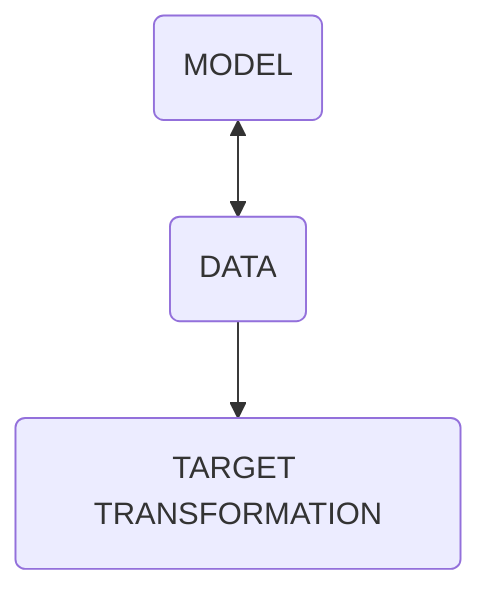

HEM

## internet music  #08

# **machine learning**
---

# What is Machine Learning?

> The field of machine learning is concerned with the question of how to construct computer programs that automatically improve with experience. T./ Mitchell, 1997, Machine Learning
---
1.  ML is a subset of IA
---
example

#### ISORYTHMIC MOTET RECOGNIZER



note:Lets go for an example, imagine that you want to write a program to reconigze an isoritmitc motet from a a choral or a 19th vocal piece.
3.  If you want to write this program using traditional programming techniques, your program is goint to get overly complex. You will have to come up with lots of rules to come up with specific curves, rules and exceptions to these rules, pitch classes, rhytmical patterns , lyric parsers an comparers to tell if it’s a composition from XVI or XIX century. But then If I give you , just one voice of the four or more, your program would not work and you would have to rewrite it.
4.  To solve the this type of problems we use ML.
5.  In ML we build a model or an engine and give it lots and lots of data.
6.  For example we give it thousands or ten of thousands of recordings of motets and vocal music. Or even better , midi files.
7.  Our model will then find and learn patterns and the input data, so we can give it a new score of any style that even wasn’t in the database, and ask it, is it a motet or is a lied or what kind of technique is using. And it will tell us with a certain level of accuracy the more input data we give it, the more accurate our model is going to be.
8.  There is a lot of phantasy but also political, social, economical, moral, and ethical implications of saying that a program learns.
9.  The first axiom of ML is : the performance of a programme improves as experience grows.
10.  Experience here means data, in quantity and in quality ← Datacentric IA. A lot of very good data.
11.  So the our first task is to learn how to build a good data-set or collection in three stages: to collect, handle, and process.
Some examples of the actual state of ML and art, and media production .
---
the performance of a programme **<mark style="background: #ABF7F7A6;">improves</mark>** as experience **<mark style="background: #BBFABBA6;">grows</mark>**.

---

### ML processes

1. DATA   /dataset 
2. DATA CLEANING
	1. TRAINING and 
	2. TEST sets
3. MODEL CREATION
 1. MODEL TRAINING
 2. EVALUATION & IMPROVEMENT
  1. temperature

note:1.  So ML involves a number of steps, the first step is to import our data which often comes in the form of a .csv file, or better known as **dataset**.
2.  Next, we need th **clean** the data. And this involves tasks such as duplicated data, irrelevant, incomplete or noisy data.
3.  Once data is clean, we need to split the data into two segments: **training** and **test sets** to make sure that our model produces the right result. For example if you have the collection of the 380 Bach chorals we can reserve 300 for training and 80 for testing (80-20%).
4.  The next step is to **create a model** and this involves selecting an algorithm to analyse the data. There are so many machine learnings algorithms out there, such as decision trees, neural networks and so on. Each algorithm have pros and cons in terms of accuracy and performance so the algorithm you use, depends on the kind of problem you’re trying to solve and your input data.
5.  Next we need to **train the model**. So we feed it our training data. On this step our model will then look for the patterns in the data, so next we can ask it to make predictions. Coming back to our motet recognition exanple, giving a header of few pitches (a partial theme of a exposition), our model can predict potential continuities based on its train. Of course, this prediction is not always accurate.
6.  This measurement of the prediction is the **evaluation and improvement** stage, and in many algorythms you will find a measure of this accuracy called _**temperature**._
---
## Nothing, Forever
---
[Nothing,Forever]

Procedurally generated sitcom
Mismatch Media, Skyler Hartle , Brian Habersberger

1. A computer broadcasts AI-generated spoof _Seinfeld_ episodes for eternity.
2. "experimental forms of television shows, video games, and more, through generative... and other machine learning technologies."
---
```embed
title: 'watchmeforever - Nothing Forever goes meta'
image: 'https://clips-media-assets2.twitch.tv/UHx-sNfdGG08c9d-o0eW0A/AT-cm|UHx-sNfdGG08c9d-o0eW0A-social-preview.jpg'
description: 'Watch watchmeforever’s clip titled “Nothing Forever goes meta”'
url: 'https://m.twitch.tv/watchmeforever/clip/EnthusiasticBrainyTrollOMGScoots-190YbTxz136jR5bQ'
```


note: 'https://m.twitch.tv/watchmeforever'

---
```


# Text Generation
## murf.ai

AI voices and youtube video extractor.
 turns your text into a human-sounding voice. This tool can also be used to create audiobooks in addition to changing the book’s voice.

## texti
```embed
title: 'Texti'
image: 'https://lh3.googleusercontent.com/0xoJYzfD-PEU4hWIJ7phcVwbum0GH-LLv0qA5WGrgARCy25Qz7nsIgICZanceKFdGzqYflwNgbJNCHyFTMJpvCTD3AE=w128-h128-e365-rj-sc0x00ffffff'
description: 'An AI that will cooperate with you to boost your copywriting skills.'
url: 'https://chrome.google.com/webstore/detail/texti/hdfpikgminknioaacfllhjjjhifoemhk'
```

---
# Image Processing

```embed
title: 'Runway - Everything you need to make anything you want.'
image: 'https://d3phaj0sisr2ct.cloudfront.net/site/images/og-card-v3.png'
description: 'Explore more than 30+ AI powered creative tools to ideate, generate and edit content like never before.'
url: 'https://runwayml.com/'
```


### vall-e
https://valle-demo.github.io/
### stability AI - Stable Diffusion
### Metaphysic
	fake tom cruise
	abba
	elvis